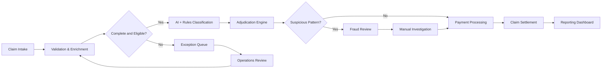
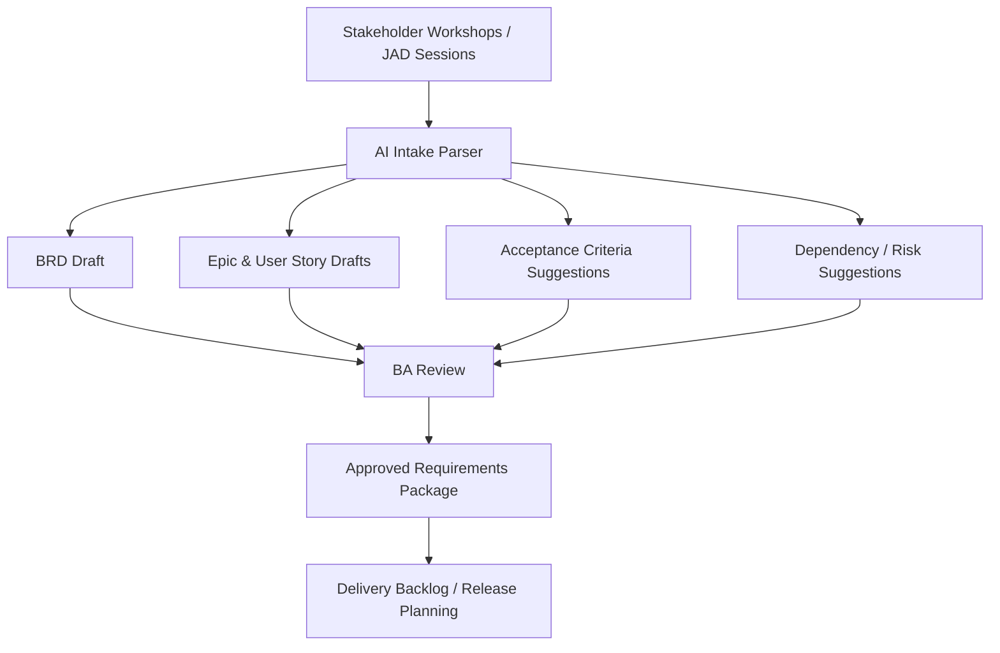
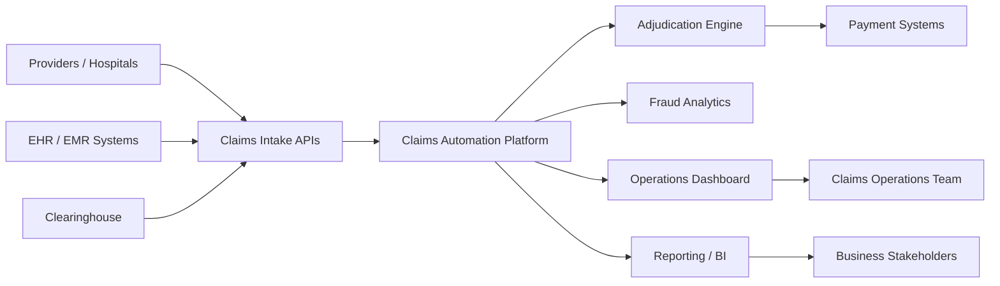

# Diagrams

## 1. End-to-End Claims Workflow

```mermaid
flowchart LR
    A[Claim Intake] --> B[Validation & Enrichment]
    B --> C{Complete and Eligible?}
    C -- Yes --> D[AI + Rules Classification]
    C -- No --> E[Exception Queue]
    D --> F[Adjudication Engine]
    F --> G{Suspicious Pattern?}
    G -- Yes --> H[Fraud Review]
    G -- No --> I[Payment Processing]
    H --> J[Manual Investigation]
    J --> I
    I --> K[Claim Settlement]
    K --> L[Reporting Dashboard]
    E --> M[Operations Review]
    M --> B
```

## 2. AI Requirements Builder Flow

```mermaid
flowchart TD
    A[Stakeholder Workshops / JAD Sessions] --> B[AI Intake Parser]
    B --> C[BRD Draft]
    B --> D[Epic & User Story Drafts]
    B --> E[Acceptance Criteria Suggestions]
    B --> F[Dependency / Risk Suggestions]
    C --> G[BA Review]
    D --> G
    E --> G
    F --> G
    G --> H[Approved Requirements Package]
    H --> I[Delivery Backlog / Release Planning]
```

## 3. System Context Diagram

```mermaid
flowchart LR
    A[Providers / Hospitals] --> B[Claims Intake APIs]
    C[EHR / EMR Systems] --> B
    D[Clearinghouse] --> B
    B --> E[Claims Automation Platform]
    E --> F[Adjudication Engine]
    E --> G[Fraud Analytics]
    E --> H[Operations Dashboard]
    E --> I[Reporting / BI]
    I --> J[Business Stakeholders]
    H --> K[Claims Operations Team]
    F --> L[Payment Systems]
```
